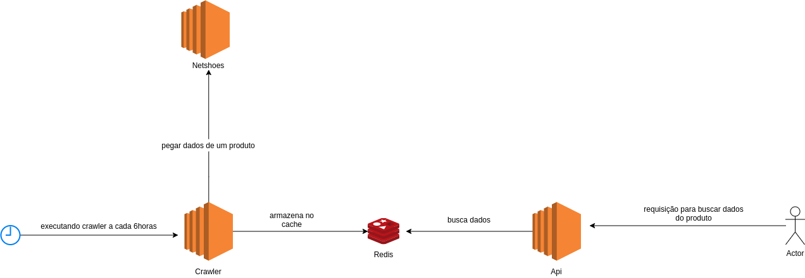

Tecnologias utilizadas:
=========================

- Node.js
- Typescript
- Redis
- Docker
- Docker compose

Arquitetura do projeto:
========================

Detalhes sobre o funcionamento do crawler:
==========================================
- O crawler é executado a cada 6 horas, pois as informações do produto não mudam com frequência e outro ponto bom sobre esse intervalo que isso evita o site faça o bloquei do crawler por muito acesso.
- Para extrair os dados title, image, price é usando axios para fazer um requisição http, pois como não precisa interar com a página fica muito mais rápido para extrair os dados do que usar o **puppeteer**
- Depois é usando o **puppeteer** para aplicar o cupom é pegar o valor do produto depois de aplicar o cupom. 
- Após pegar o valor é armazenado no redis que foi usando com banco de dados aqui para o teste, mas em produção o correto é armazenar em um banco de dados que escreve em disco.
- O crawler é um processo a parte onde extrai os dados é armazena os dados no redis depois a api vai pegar os dados armazenados no redis. O que me motivou a fazer dessa forma foi porque se o crawler extrair os dados no momento que e feita a requisição para rota isso não seria performático é não gera um boa experiência para usuário que vai usar a aplicação. 

Aspectos aplicados no crawler para evitar ser bloqueado:
=========================================================

- Executar o crawler em um intervalo maior evitando acessos frequentes ao site. No caso intervalo de 6 horas, mas caso tenha que fazer acesso com mais frequência deve se criar uma lógica que executa o crawler em horários aleatórios.

- Quando é usando o **puppeteer** é definido um user-agent aleatório para executação para evitar que o site acessado bloquei o acesso de um user-agent especifico.

- Outro ponto que pode ser aplicado para evitar o crawler se bloqueado é usar um serviço de Proxy de ip onde você contrato esse serviço é quando você for acessar o site está usando esse serviço onde cada acesso terá um ip aleatório. O serviço https://oxylabs.io/ possui esse tipo de solução. Não foi aplicado no crawler devido ser comprado para usar o serviço.

Instruções para rodar o projeto:
=================================

- Clonar projeto
- Criar arquivo **.env** baseado no arquivo **.env.example** 
- Depois executa o comando: **docker-compose up -d** esse comando irá criar um container para redis(banco de dados que armazena os dados), um para rodar um job que executa o crawler a cada 6 horas e um container que cria um api simples para expor os dados extraídos.
- Após o comando acima finalizar acesso o navegador no endereço: http://localhost:3001/extracted-products caso não retorne os dados é por que o crawler está extraíndo é depois de um tempo faça um requisição para acessar os dados extraídos.